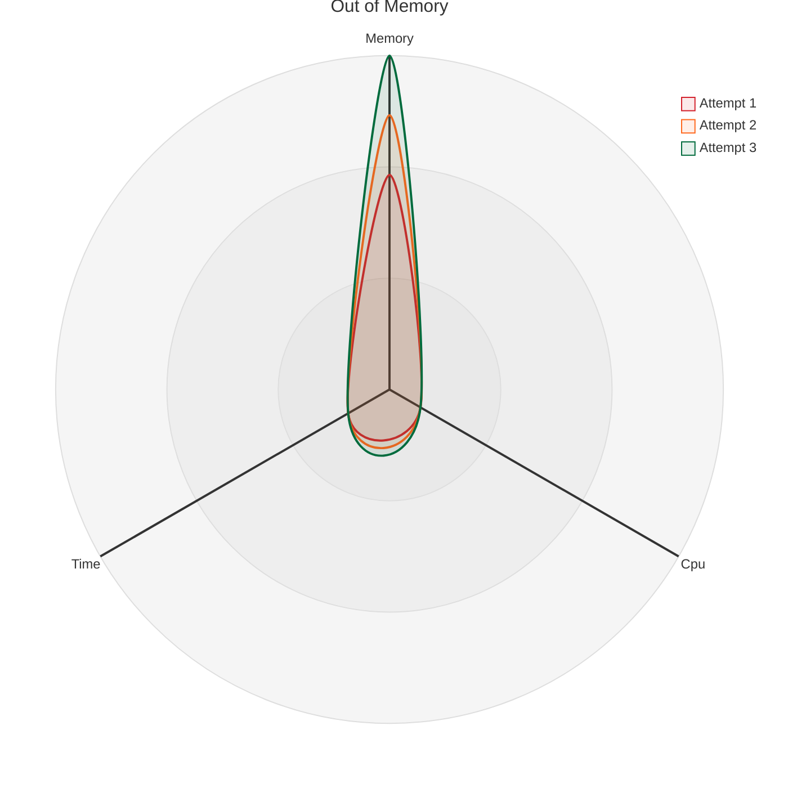
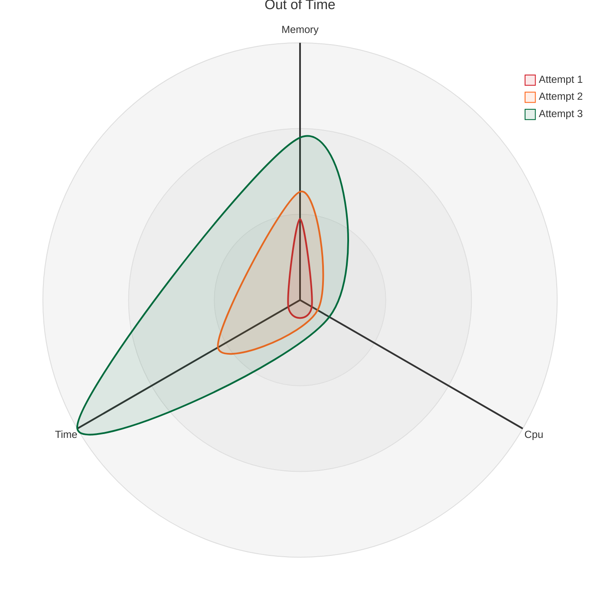
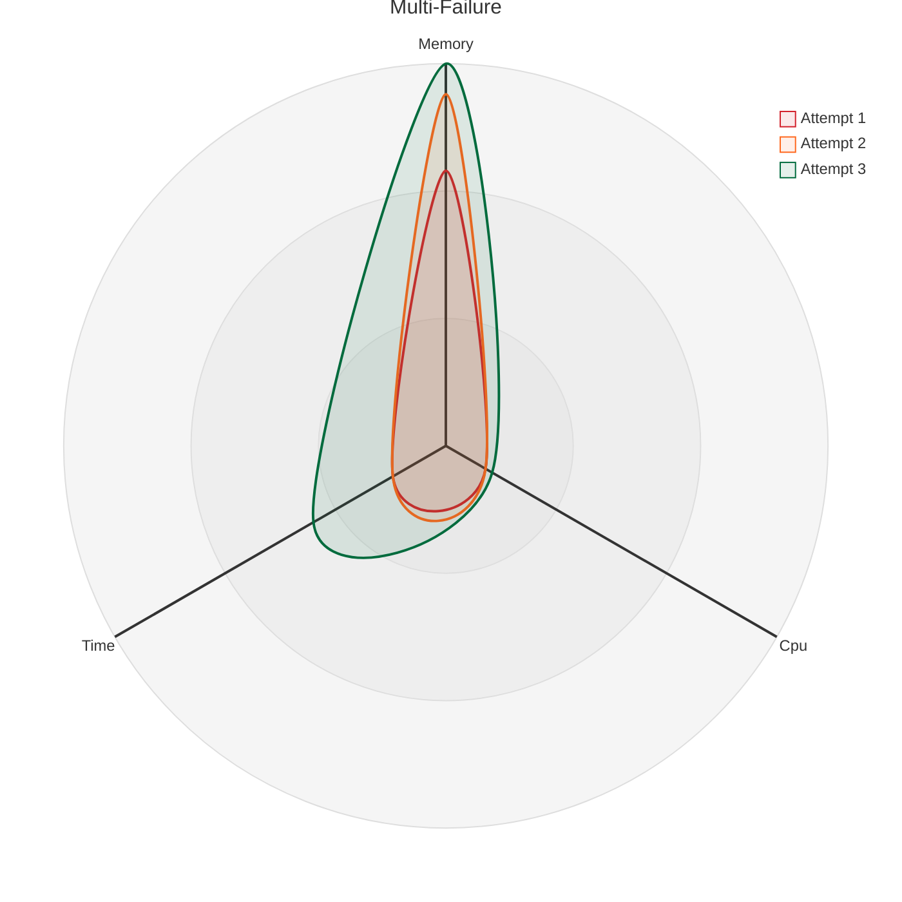

# nf-core/configs: IRIS Configuration

All nf-core pipelines have been successfully configured for use on the IRIS cluster at [Memorial Sloan Kettering Cancer Center (MSKCC)](https://www.mskcc.org/).

To use, run the pipeline with `-profile iris`. This will download and launch the [`iris.config`](../conf/iris.config) which has been pre-configured with a setup suitable for the IRIS cluster. Using this profile, Singularity images containing all required software will be pulled from our local library or downloaded and cached before execution of the pipeline.

## Before running the pipeline

Before running a pipeline for the first time, you will need to ensure that right version of Java, Nextflow and Singularity are available on the cluster. The IRIS cluster uses the `SLURM` job scheduler, and Nextflow will automatically submit jobs via SLURM.

### Load Java and Singularity

```bash
module load java/23.0.1
```

Singularity 4.1 should be loaded by default at `/usr/bin/singularity`

### Install Nextflow

You can install nextflow by running:

```bash
curl -s https://get.nextflow.io | bash
chmod +x nextflow
```

## Running the pipeline

A typical command to run an nf-core pipeline on IRIS would look like:

```bash
nextflow run nf-core/<PIPELINE> -profile iris [additional pipeline parameters]
```

### Optional Parameters

The IRIS config provides several optional parameters to customize job submission and paths:

- `--group`: Your IRIS group name (e.g., `core006`). When specified, sets the default working directory to `/scratch/<YOUR_GROUP>/work`. If not specified, the working directory defaults to `./work` in your current directory.
- `--partition`: Specify a SLURM partition (default: uses `$NXF_SLURM_PARTITION` environment variable or `cpu`)
- `--qos`: Set Quality of Service specification for SLURM jobs (e.g., `priority`)
- `--preemptable`: Set to `true` to use preemptable queues for faster job submission (default: `false`)
- `--isolated`: Set to `true` to restrict jobs to only the specified partition (default: `false`)

### Example Commands

Basic usage:

```bash
nextflow run nf-core/rnaseq -profile iris --input samplesheet.csv --genome GRCh38
```

Using the group parameter to set default working directory:

```bash
nextflow run nf-core/rnaseq -profile iris --group mygroup --input samplesheet.csv --genome GRCh38
```

Explicitly setting work and output directories:

```bash
nextflow run nf-core/rnaseq -profile iris \
  -work-dir /scratch/mygroup/work \
  --outdir /data1/mygroup/results \
  --input samplesheet.csv --genome GRCh38
```

Using preemptable queue for faster submission:

```bash
nextflow run nf-core/rnaseq -profile iris --preemptable true --input samplesheet.csv --genome GRCh38
```

Using a QoS for priority:

```bash
nextflow run nf-core/rnaseq -profile iris --partition cpu --qos priority --input samplesheet.csv --genome GRCh38
```

## Cluster Details

### Resource Limits

The IRIS config sets the following maximum resource limits:

- **CPUs**: 52 cores per job
- **Memory**: 550 GB per job
- **Time**: 7 days per job

### Queue Selection

The config automatically selects appropriate SLURM queues based on job requirements:

- **cpushort**: Jobs with runtime ≤ 2 hours (CPU only)
- **gpushort**: GPU jobs with runtime ≤ 2 hours
- **gpu**: Regular GPU jobs
- **cpu_highmem**: Jobs requiring ≥ 512 GB memory or ≥ 50 GB per CPU
- **preemptable**: Use the preemptable queue when `--preemptable true` is set
- **cpu**: Default queue for standard CPU jobs

### GPU Support

The config includes support for GPU jobs. Processes labeled with `process_gpu` or `process_gpu_low` will automatically:

- Request GPU resources via SLURM (`--gres=gpu:1`)
- Use appropriate GPU queues (`gpu` or `gpushort`)
- Enable GPU support in Singularity containers (`--nv` flag)

### Proactive Resource Detection

The system also monitors resource usage patterns to prevent failures:

- **Near Out of Memory**: When peak RSS reaches ≥80% of allocated memory
- **Near Out of Time**: When realtime reaches ≥80% of allocated time
- **CPU Starved**: When CPU usage reaches ≥80% of available CPU capacity

These conditions trigger proactive resource increases even if the job completes successfully, helping prevent failures in subsequent similar jobs.

### Process Labels

The config defines several process labels with default resources that scale automatically:

| Label                 | CPUs | Memory | Time |
| --------------------- | ---- | ------ | ---- |
| `process_single`      | 1    | 1 GB   | 4 h  |
| `process_low`         | 2    | 12 GB  | 2 h  |
| `process_medium`      | 6    | 36 GB  | 8 h  |
| `process_high`        | 12   | 72 GB  | 16 h |
| `process_long`        | 2    | 12 GB  | 20 h |
| `process_high_memory` | 6    | 200 GB | 8 h  |
| `process_gpu`         | 6    | 25 GB  | 8 h  |
| `process_gpu_low`     | 6    | 25 GB  | 2 h  |

These are starting values that will be automatically increased on retry if needed.

## Singularity Configuration

The config uses Singularity for containerization with the following settings:

- **Cache Directory**: Automatically set based on working directory or `$NXF_SINGULARITY_CACHEDIR`
- **Library Directory**: Uses the shared library, `/data1/core006/resources/singularity_image_library` (or `$NXF_SINGULARITY_LIBRARYDIR`)
- **Auto-mounting**: Enabled for seamless file access
- **Scratch Space**: Uses `/localscratch` when available

## Working Directory

- If the working directory is not set it is automatically configured based on your group (via --group `<YOUR_GROUP>`).
- Otherwise, the work directory is `./work` in your current directory
- Automatic cleanup is enabled when using `/scratch` to save space

## Automatic Resource Management

The IRIS config includes intelligent retry logic that automatically adjusts resources when jobs fail. The system monitors job execution and dynamically scales resources based on failure patterns and resource utilization.

### Retry Strategy Overview

- Jobs are automatically retried up to 3 times on failure
- Resources are dynamically increased based on the failure type and attempt number
- The system uses both **multiplicative** (scales with attempt) and **additive** (fixed increment) strategies

### Resource Scaling Logic

#### Memory Scaling

Memory is increased based on the failure type:

| Failure Condition                  | Attempt 2        | Attempt 3        | Attempt 4+       |
| ---------------------------------- | ---------------- | ---------------- | ---------------- |
| **Out of Memory** (exit 125, 137)  | Previous + 10 GB | Previous + 20 GB | Previous + 30 GB |
| **Out of Time** (exit 15, 140)     | Previous + 4 GB  | Previous + 8 GB  | Previous + 12 GB |
| **Near Out of Memory** (≥80% used) | Previous + 4 GB  | Previous + 8 GB  | Previous + 12 GB |
| **Other failures**                 | Previous + 2 GB  | Previous + 4 GB  | Previous + 10 GB |

**Formula**: `new_memory = previous_memory + (multiplier × attempt) + base_increment`

#### CPU Scaling

CPUs are increased when jobs are time-constrained or CPU-starved:

| Failure Condition                | Attempt 2    | Attempt 3    | Attempt 4+   |
| -------------------------------- | ------------ | ------------ | ------------ |
| **Out of Time** (exit 15, 140)   | Previous + 1 | Previous + 2 | Previous + 3 |
| **Near Out of Time** (≥80% used) | Previous + 1 | Previous + 2 | Previous + 3 |
| **CPU Starved** (≥80% CPU usage) | Previous + 2 | Previous + 4 | Previous + 5 |
| **Other failures**               | Previous     | Previous     | Previous + 1 |

**Formula**: `new_cpus = previous_cpus + (multiplier × attempt) + base_increment`

#### Time Scaling

Runtime limits are increased for time-related failures:

| Failure Condition                | Attempt 2       | Attempt 3       | Attempt 4+      |
| -------------------------------- | --------------- | --------------- | --------------- |
| **Out of Time** (exit 15, 140)   | Previous + 12 h | Previous + 24 h | Previous + 36 h |
| **Near Out of Time** (≥80% used) | Previous + 12 h | Previous + 24 h | Previous + 36 h |
| **Other failures**               | Previous + 2 h  | Previous + 4 h  | Previous + 1 d  |

**Formula**: `new_time = previous_time + (multiplier × attempt) + base_increment`

### Example Retries

#### Out of Memory Failure

A `process_medium` job runs out of memory:

```
Attempt 1: 6 CPUs, 36 GB, 8h    → Out of Memory (exit 137)
Attempt 2: 6 CPUs, 46 GB, 8h    → Out of Memory (exit 137)
Attempt 3: 6 CPUs, 56 GB, 8h    → Success
```



#### Out of Time Failure

A `process_low` job exceeds the time limit:

```
Attempt 1: 2 CPUs, 12 GB, 2h     → Out of Time (exit 140)
Attempt 2: 3 CPUs, 16 GB, 14h    → Out of Time (exit 140)
Attempt 3: 5 CPUs, 24 GB, 38h    → Success
```



#### Complex Multi-Failure Path

A job experiences multiple failure types across retries:

```
Attempt 1: 6 CPUs, 36 GB, 8h     → Out of Memory (exit 137)
Attempt 2: 6 CPUs, 46 GB, 8h     → Out of Time (exit 140)
Attempt 3: 7 CPUs, 50 GB, 20h    → Success
```



## Getting Help

If you have any questions or issues running nf-core pipelines on IRIS, please contact:

- **IRIS Support**: Nikhil Kumar (kumarn1@mskcc.org)
- **nf-core Slack**: [https://nfcore.slack.com](https://nfcore.slack.com)

## Notes

> **Note**: You will need an account on the IRIS cluster at MSKCC to use this profile.

> **Note**: Nextflow should be run from a compute node (via `srun` or `sbatch`), not from the login node, to avoid overloading the login infrastructure.

> **Note**: The config automatically enables trace reports to help monitor pipeline execution and resource usage.
